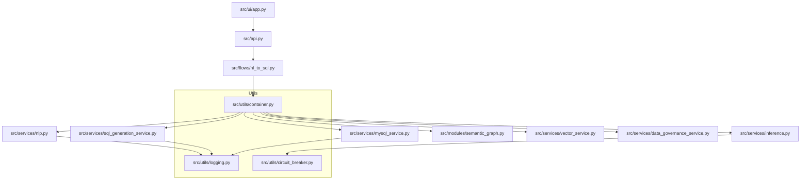
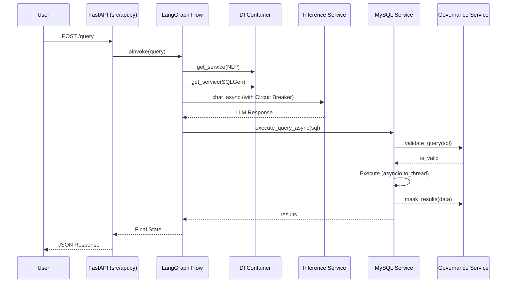

# Codebase Audit & Refactoring Status

## 1. Codebase Structure & Dependencies

### High-Level Dependency Map

### Core Module Responsibilities
- **src/utils/container.py**: Singleton Dependency Injection container managing service lifecycles.
- **src/utils/logging.py**: Centralized logging with App, Audit, and Performance (latency) loggers.
- **src/utils/circuit_breaker.py**: Resilience pattern for external LLM API calls.
- **src/flows/nl_to_sql.py**: Async LangGraph orchestration flow using `ainvoke`.
- **src/services/inference.py**: Async multi-provider LLM adapter with circuit breakers and performance tracking.
- **src/services/mysql_service.py**: Async database execution with audit logging and result masking.
- **src/services/data_governance_service.py**: Policy engine for SQL validation and data masking.
- **src/services/nlp.py**: Intent extraction using vector-filtered context.
- **src/services/sql_generation_service.py**: Prompt engineering for SQL generation with governance filtering.

---

## 2. Sequence Diagrams

### Main NLQ to SQL Flow (Async)

---

## 3. Testing Methodology & Coverage

### Current State
- **Unit Tests**: Located in `tests/unit/`. Covers `DataGovernanceService`.
- **Integration Tests**: Located in `tests/integration/`. Covers `MySQLService` + `DataGovernanceService`.
- **Evaluation Framework**: `scripts/run_nlq_tests.py` runs a suite of NLQ cases from `tests/nlq_test_cases.jsonl`.

### Gaps
- No unit tests for `SemanticGraph` pathfinding logic.
- No unit tests for `NLQIntentAnalyzer` (needs LLM mocking).
- No automated coverage reporting (e.g., `pytest-cov`).

---

## 4. Security & Resilience Status

### Completed Improvements
- [x] **Dependency Injection**: Centralized service management in `src/utils/container.py`.
- [x] **Async/Await**: Full async support for API, Flow, and Inference services.
- [x] **Circuit Breakers**: Implemented for OpenAI, Gemini, and Ollama to handle API failures gracefully.
- [x] **Observability**: Three-tier logging (App, Audit, Performance) implemented across all services.
- [x] **Cleanup**: Removed legacy `src/models/`, `src/dummies/`, and unused scripts.

### Remaining Security Glitches
1. **Over-privileged DB User**: `init/create_user.sql` still grants `ALL PRIVILEGES`.
   - *Fix*: Restrict to `SELECT` on the target database for the application user.
2. **Raw SQL Execution**: While `DataGovernanceService` validates queries, a read-only DB user is still the best defense.
3. **Hardcoded Credentials**: Transition to `pydantic-settings` for better environment variable management.

---

## 5. Future Roadmap

### Phase 1: Quality & Scalability
- [ ] **Expand Test Suite**: Add unit tests for `SemanticGraph` and `NLQIntentAnalyzer` using `unittest.mock`.
- [ ] **Connection Pooling**: Implement pooling in `MySQLService` for better performance under load.
- [ ] **Caching Layer**: Add Redis or in-memory caching for frequent NLQ queries to reduce LLM costs.

### Phase 2: DevOps & Deployment
- [ ] **CI/CD Integration**: Add GitHub Actions for automated testing and linting.
- [ ] **Containerization**: Create a `Dockerfile` and `docker-compose.yml` for the full stack (App, MySQL, ChromaDB).
- [ ] **Monitoring**: Integrate with Prometheus/Grafana using the `performance_logger` data.

