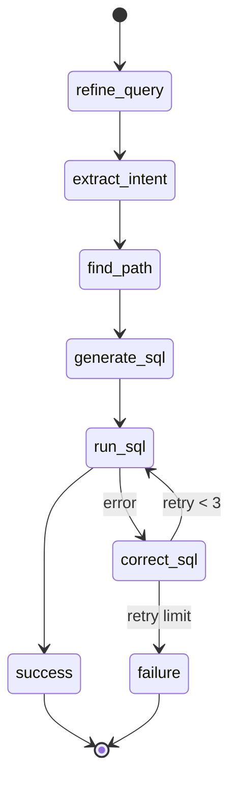
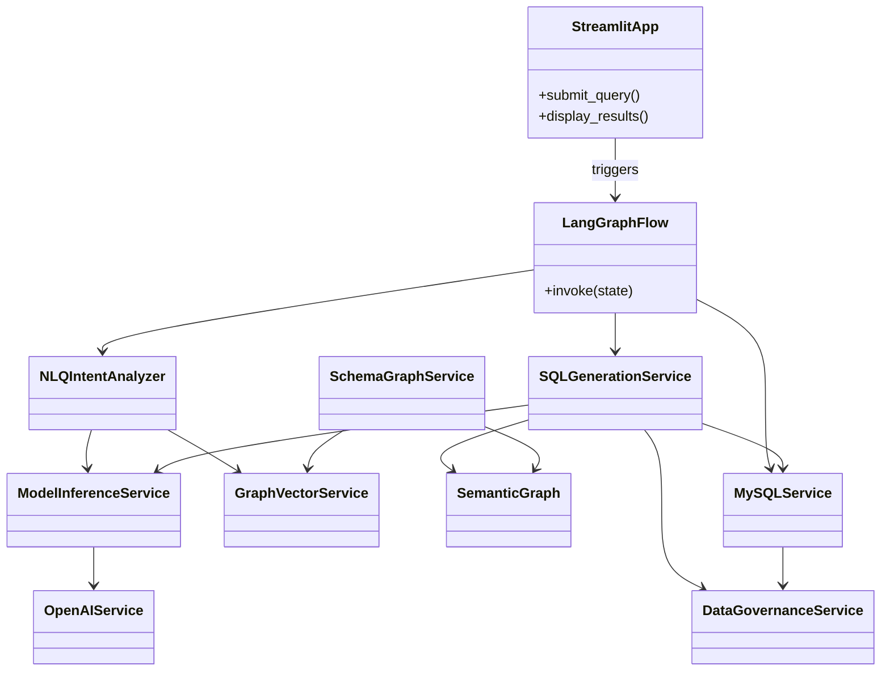
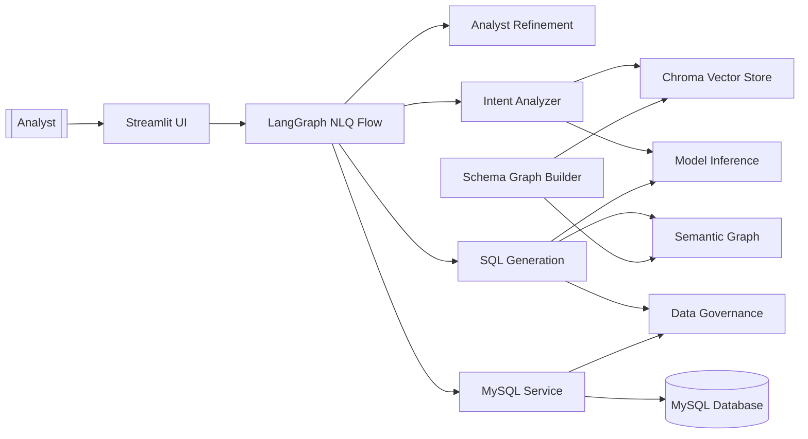
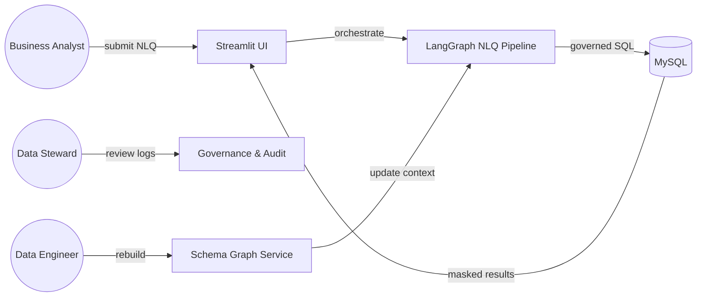

# System Architecture

## Overview

- Converts natural language questions into governed SQL against a MySQL warehouse.
- Combines a semantic schema graph, vector retrieval, and multi-provider LLM orchestration.
- Protects sensitive data through policy-aware SQL generation, execution, and result masking.

## Layered Architecture

- **Presentation**: Streamlit UI in [src/ui/app.py](src/ui/app.py) collects queries and renders tables.
- **Orchestration**: LangGraph pipeline in [src/flows/nl_to_sql.py](src/flows/nl_to_sql.py) coordinates analyst refinement, intent extraction, SQL generation, execution, and retries.
- **Services**: Intent, SQL, vector, schema, governance, and database services under [src/services](src/services) implement reusable capabilities.
- **Data & Context**: Semantic graph JSON, ChromaDB embeddings, and operational MySQL database provide the context required by the LLM.

## LangGraph Flow

### Step Details

1. **refine_query**: Applies the analyst-style prompt in [src/flows/nl_to_sql.py](src/flows/nl_to_sql.py) to clarify intent and surface relevant tables before LLM reasoning.
2. **extract_intent**: Delegates to NLQIntentAnalyzer from [src/services/nlp.py](src/services/nlp.py) which blends vector-filtered schema context with the active LLM to emit start_node, end_node, and join condition hints.
3. **find_path**: Uses SemanticGraph traversal from [src/modules/semantic_graph.py](src/modules/semantic_graph.py) to compute join paths, falling back to single-entity shortcuts when appropriate.
4. **generate_sql**: SQLGenerationService in [src/services/sql_generation_service.py](src/services/sql_generation_service.py) builds a governance-aware prompt, filters sensitive columns, and requests structured SQL output.
5. **run_sql**: MySQLService in [src/services/mysql_service.py](src/services/mysql_service.py) validates queries, masks results, and records audit events.
6. **correct_sql**: Re-prompts the LLM with execution errors for iterative fixes until success or retry exhaustion.

## Core Services

- **Model orchestration**: [src/services/inference.py](src/services/inference.py) hosts OpenAI, Gemini, and Ollama adapters plus a generic ModelInferenceService to allow tiered failover.
- **Intent analysis**: [src/services/nlp.py](src/services/nlp.py) formats schema context, leverages vector search, and extracts path parameters via structured LLM responses.
- **SQL generation**: [src/services/sql_generation_service.py](src/services/sql_generation_service.py) composes rich prompts, enforces governance in prompts and outputs, and reuses MySQLService for execution.
- **Database access**: [src/services/mysql_service.py](src/services/mysql_service.py) performs policy validation, query execution, masking, and audit logging.
- **Vector retrieval**: [src/services/vector_service.py](src/services/vector_service.py) indexes SemanticGraph nodes into ChromaDB using Ollama embeddings and serves top-k matches to intent analysis.
- **Schema graph management**: [src/services/schema_graph_service.py](src/services/schema_graph_service.py) extracts relational metadata, enriches it with profiling data, and exports the JSON graph consumed elsewhere.
- **Governance policies**: [src/services/data_governance_service.py](src/services/data_governance_service.py) maintains sensitive keyword catalogs, blocks or sanitizes risky SQL, and masks result sets.

## Data Governance and Observability

- Governance is enabled by default through environment flags and can optionally load custom sensitive column lists.
- SQLGenerationService filters out sensitive attributes before prompting and sanitizes offending SQL responses when validation fails.
- MySQLService performs pre-execution validation, raises SecurityError on policy violations, and masks sensitive columns (full or partial) in result rows.
- All query attempts are logged to logs/mysql_audit.log for traceability, capturing blocked, successful, and failed executions.

## Schema and Retrieval Context

- SchemaGraphService produces semantic graphs enriched by optional DB profiling (row counts, business purpose, semantic tags) to improve downstream prompts and embeddings.
- GraphVectorService turns each graph node into a rich semantic document for retrieval, enabling NLQIntentAnalyzer to narrow context to relevant tables and columns.
- SemanticGraph provides traversal helpers (paths, neighbors, edge metadata) leveraged by LangGraph nodes and SQLGenerationService.

## High-Level Class Relationships

## Service Dependency Map

## Primary Use Cases

- **Run governed NLQ**: Analyst submits a natural language question and receives governed query results.
- **Inspect query lineage**: Administrator reviews audit logs and governance summaries for executed queries.
- **Refresh schema context**: Engineer rebuilds semantic graph and vector store to reflect schema changes.

## Extensibility Notes

- Model providers can be swapped by configuring ModelInferenceService; fallbacks enable resilience when a primary LLM is unavailable.
- Data governance policies can incorporate custom keyword catalogs or external policy engines without altering LangGraph steps.
- Additional LangGraph nodes (e.g., knowledge base expansion or visual summaries) can be inserted before or after existing states with minimal coupling.
