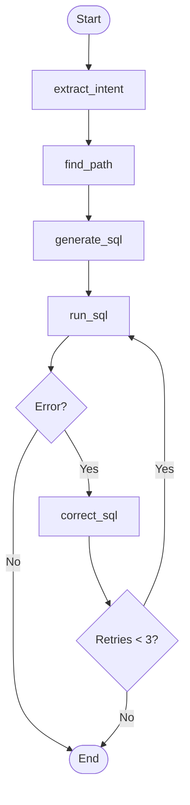
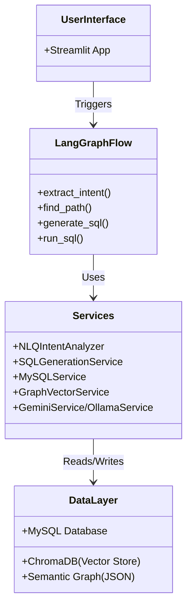

# System Architecture

## Overview

The NLQ Enhancement project is designed to convert Natural Language Queries (NLQ) into SQL queries, execute them against a MySQL database, and return the results. The system leverages a semantic graph of the database schema, vector embeddings for context retrieval, and Large Language Models (LLMs) for intent analysis and SQL generation.

## Core Working Principle (LangGraph)

The core logic of the NLQ to SQL conversion is orchestrated using `LangGraph`. The flow is defined in `src/flows/nl_to_sql.py`.

### State Graph

The workflow is modeled as a state machine with the following nodes:

1.  **extract_intent**: Analyzes the user's natural language query to identify the start node, end node, and conditions for traversing the semantic graph.
2.  **find_path**: Searches the semantic graph for a path between the identified start and end nodes.
3.  **generate_sql**: Generates a SQL query based on the found path and the user's query using an LLM.
4.  **run_sql**: Executes the generated SQL query against the database.
5.  **correct_sql**: (Conditional) If the SQL execution fails, this node attempts to correct the SQL query using the error message and the LLM.

### Flow Diagram

### Detailed Flow Steps

1.  **Start**: The process begins with a user query.
2.  **Extract Intent (`NLQIntentAnalyzer`)**:
    *   Input: User query.
    *   Action: Uses an LLM (Gemini/Ollama) and Vector Search to identify relevant schema nodes (tables/columns).
    *   Output: `start_node`, `end_node`, `condition`.
3.  **Find Path (`SemanticGraph`)**:
    *   Input: `start_node`, `end_node`.
    *   Action: Performs a pathfinding algorithm (e.g., Dijkstra or BFS) on the semantic graph to find the optimal join path between tables.
    *   Output: A list of nodes representing the path (e.g., `['users', 'orders', 'order_items']`).
4.  **Generate SQL (`SQLGenerationService`)**:
    *   Input: Path, Graph Schema, User Query.
    *   Action: Constructs a prompt with edge details and table schemas, then asks the LLM to generate a valid SQL query.
    *   Output: SQL query string.
5.  **Run SQL (`MySQLService`)**:
    *   Input: SQL query.
    *   Action: Executes the query on the MySQL database.
    *   Output: Query results or an error message.
6.  **Error Handling & Correction**:
    *   If an error occurs, the flow transitions to `correct_sql`.
    *   The LLM is provided with the invalid SQL, the error message, and the original user query to generate a corrected SQL.
    *   The system retries up to a configured limit (e.g., 3 times).

## High-Level Architecture

## Key Components

*   **Semantic Graph**: Represents the database schema as a graph where nodes are tables/columns and edges are relationships (foreign keys, associations).
*   **Vector Store (ChromaDB)**: Stores embeddings of graph nodes to allow semantic search for identifying relevant tables based on user queries.
*   **LLM Service**: Provides an interface to various LLMs (Gemini, Ollama, OpenAI) for natural language processing tasks.
