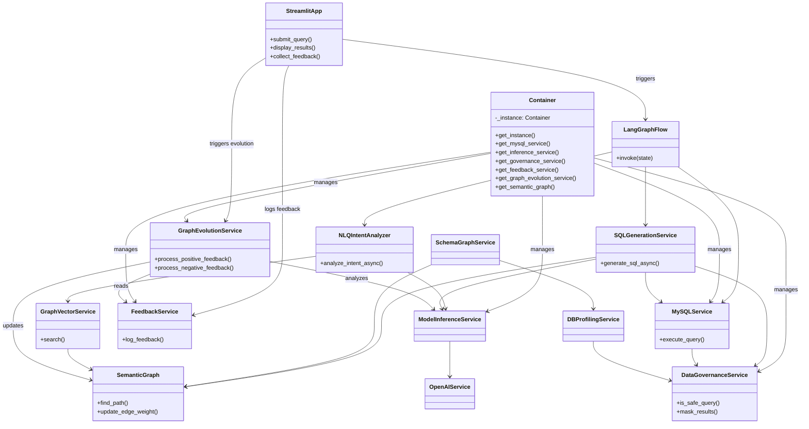

# System Architecture

## Overview

- Converts natural language questions into governed SQL against a MySQL warehouse.
- Combines a semantic schema graph, vector retrieval, and multi-provider LLM orchestration.
- Protects sensitive data through policy-aware SQL generation, execution, and result masking.
- **Industrial-Grade Foundation**: Built with Dependency Injection, Asynchronous processing, and Resiliency patterns (Circuit Breakers, Retries).

## Layered Architecture

- **Presentation**: Streamlit UI in [src/ui/app.py](src/ui/app.py) collects queries and renders tables.
- **Orchestration**: LangGraph pipeline in [src/flows/nl_to_sql.py](src/flows/nl_to_sql.py) coordinates analyst refinement, intent extraction, SQL generation, execution, and retries.
- **Services**: Intent, SQL, vector, schema, governance, and database services under [src/services](src/services) implement reusable capabilities.
- **Infrastructure**: Dependency Injection container in [src/models/model.py](src/models/model.py) manages service lifecycles and configuration.
- **Data & Context**: Semantic graph JSON, ChromaDB embeddings, and operational MySQL database provide the context required by the LLM.

## Industrial-Grade Refactoring

The system has been refactored from a prototype into an industrial-grade application with the following features:

### 1. Dependency Injection (DI)
- Uses a centralized `Container` class to manage service instances.
- Promotes loose coupling and high testability by allowing easy mocking of dependencies.
- Supports singleton patterns for resource-heavy services like LLM and Vector stores.

### 2. Asynchronous Processing
- Core services support `async/await` for non-blocking I/O operations.
- `MySQLService` uses `asyncio.to_thread` for thread-safe database operations.
- `InferenceService` handles concurrent LLM requests efficiently.

### 3. Resiliency Patterns
- **Circuit Breakers**: Protects the system from cascading failures when LLM providers (OpenAI, Gemini) are down or throttled.
- **Robust Retries**: Uses `tenacity` for intelligent retry logic with exponential backoff during SQL generation and execution.
- **Graceful Fallbacks**: Multi-model orchestration allows falling back from primary (Gemini) to secondary (Ollama/OpenAI) providers.

## LangGraph Flow


### Step Details

1. **refine_query**: Applies the analyst-style prompt in [src/flows/nl_to_sql.py](src/flows/nl_to_sql.py) to clarify intent and surface relevant tables before LLM reasoning.
2. **extract_intent**: Delegates to NLQIntentAnalyzer from [src/services/nlp.py](src/services/nlp.py) which blends vector-filtered schema context with the active LLM to emit start_node, end_node, and join condition hints.
3. **find_path**: Uses SemanticGraph traversal from [src/modules/semantic_graph.py](src/modules/semantic_graph.py) to compute join paths, falling back to single-entity shortcuts when appropriate.
4. **generate_sql**: SQLGenerationService in [src/services/sql_generation_service.py](src/services/sql_generation_service.py) builds a governance-aware prompt, filters sensitive columns, and requests structured SQL output.
5. **run_sql**: MySQLService in [src/services/mysql_service.py](src/services/mysql_service.py) validates queries, masks results, and records audit events.
6. **correct_sql**: Re-prompts the LLM with execution errors for iterative fixes until success or retry exhaustion.

## Core Services

- **Model orchestration**: [src/services/inference.py](src/services/inference.py) hosts OpenAI, Gemini, and Ollama adapters plus a generic ModelInferenceService to allow tiered failover.
- **Intent analysis**: [src/services/nlp.py](src/services/nlp.py) formats schema context, leverages vector search, and extracts path parameters via structured LLM responses.
- **SQL generation**: [src/services/sql_generation_service.py](src/services/sql_generation_service.py) composes rich prompts, enforces governance in prompts and outputs, and reuses MySQLService for execution.
- **Database access**: [src/services/mysql_service.py](src/services/mysql_service.py) performs policy validation, query execution, masking, and audit logging.
- **Vector retrieval**: [src/services/vector_service.py](src/services/vector_service.py) indexes SemanticGraph nodes into ChromaDB using Ollama embeddings and serves top-k matches to intent analysis.
- **Schema graph management**: [src/services/schema_graph_service.py](src/services/schema_graph_service.py) extracts relational metadata, enriches it with profiling data, and exports the JSON graph consumed elsewhere.
- **Governance policies**: [src/services/data_governance_service.py](src/services/data_governance_service.py) maintains sensitive keyword catalogs, blocks or sanitizes risky SQL, and masks result sets.

## Data Governance and Observability

- **Policy Enforcement**: Governance is enabled by default through environment flags and can optionally load custom sensitive column lists.
- **Adversarial Query Blocking**: `DataGovernanceService` uses advanced regex-based identifier detection to block sensitive data access even in complex SQL structures like `UNION`, subqueries, and nested joins.
- **SQL Sanitization**: `SQLGenerationService` filters out sensitive attributes before prompting and sanitizes offending SQL responses when validation fails.
- **Result Masking**: `MySQLService` performs pre-execution validation, raises `SecurityError` on policy violations, and masks sensitive columns (full or partial) in result rows.
- **Profiling Masking**: `DBProfilingService` masks sensitive data at the SQL level during the profiling phase, ensuring PII never enters the application context.
- **Audit Logging**: All query attempts are logged to `logs/audit.log` for traceability, capturing `BLOCKED`, `SUCCESS`, and `ERROR` executions with full SQL context.

## Testing Infrastructure

The project implements a 4-tier testing strategy to ensure end-to-end reliability:

1. **Unit Testing**: Validates individual service logic with 70%+ coverage.
2. **Integration Testing**: Verifies interactions between services (e.g., DB Reader -> Schema Graph -> Semantic Graph).
3. **Functional Testing**: Validates the complete NL-to-SQL flow using mocked LLM responses and real orchestration logic.
4. **Security Testing**: Specifically targets SQL injection, governance bypass attempts, and data masking effectiveness.

## Schema and Retrieval Context

- SchemaGraphService produces semantic graphs enriched by optional DB profiling (row counts, business purpose, semantic tags) to improve downstream prompts and embeddings.
- GraphVectorService turns each graph node into a rich semantic document for retrieval, enabling NLQIntentAnalyzer to narrow context to relevant tables and columns.
- SemanticGraph provides traversal helpers (paths, neighbors, edge metadata) leveraged by LangGraph nodes and SQLGenerationService.

## High-Level Class Relationships



## Dependency Injection (DI) Visualization

The system uses a centralized `Container` (Singleton) to wire all dependencies. This ensures that services like `SQLGenerationService` don't instantiate their own dependencies (like `MySQLService` or `InferenceService`), but receive them ready-to-use.

```mermaid
graph TD
    subgraph "DI Container"
        Config[Configuration (.env)]
        
        subgraph "Core Services"
            LLM[Inference Service]
            DB[MySQL Service]
            Gov[Governance Service]
            Vector[Vector Service]
            Graph[Semantic Graph]
            FB[Feedback Service]
        end
        
        subgraph "Composite Services"
            Intent[Intent Analyzer]
            SQLGen[SQL Generator]
            Evol[Evolution Service]
        end
        
        Config --> LLM
        Config --> DB
        
        Gov --> DB
        Gov --> SQLGen
        
        LLM --> Intent
        LLM --> SQLGen
        LLM --> Evol
        
        Vector --> Intent
        Graph --> Intent
        Graph --> SQLGen
        Graph --> Evol
        
        DB --> SQLGen
        FB --> Evol
    end
    
    Client[Main App] -->|Container.get_instance()| Container
    Container -->|get_sql_generator()| SQLGen
```

## Service Dependency Map


## Primary Use Cases

- **Run governed NLQ**: Analyst submits a natural language question and receives governed query results.
- **Inspect query lineage**: Administrator reviews audit logs and governance summaries for executed queries.
- **Refresh schema context**: Engineer rebuilds semantic graph and vector store to reflect schema changes.


## Extensibility Notes

- Model providers can be swapped by configuring ModelInferenceService; fallbacks enable resilience when a primary LLM is unavailable.
- Data governance policies can incorporate custom keyword catalogs or external policy engines without altering LangGraph steps.
- Additional LangGraph nodes (e.g., knowledge base expansion or visual summaries) can be inserted before or after existing states with minimal coupling.
