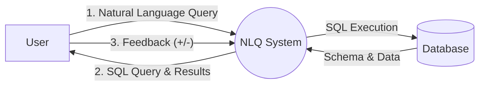
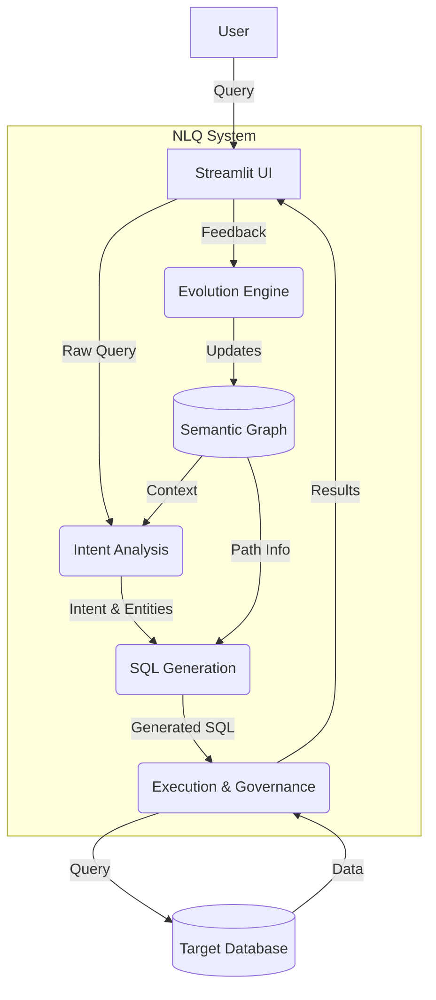
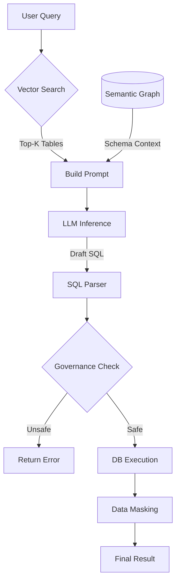
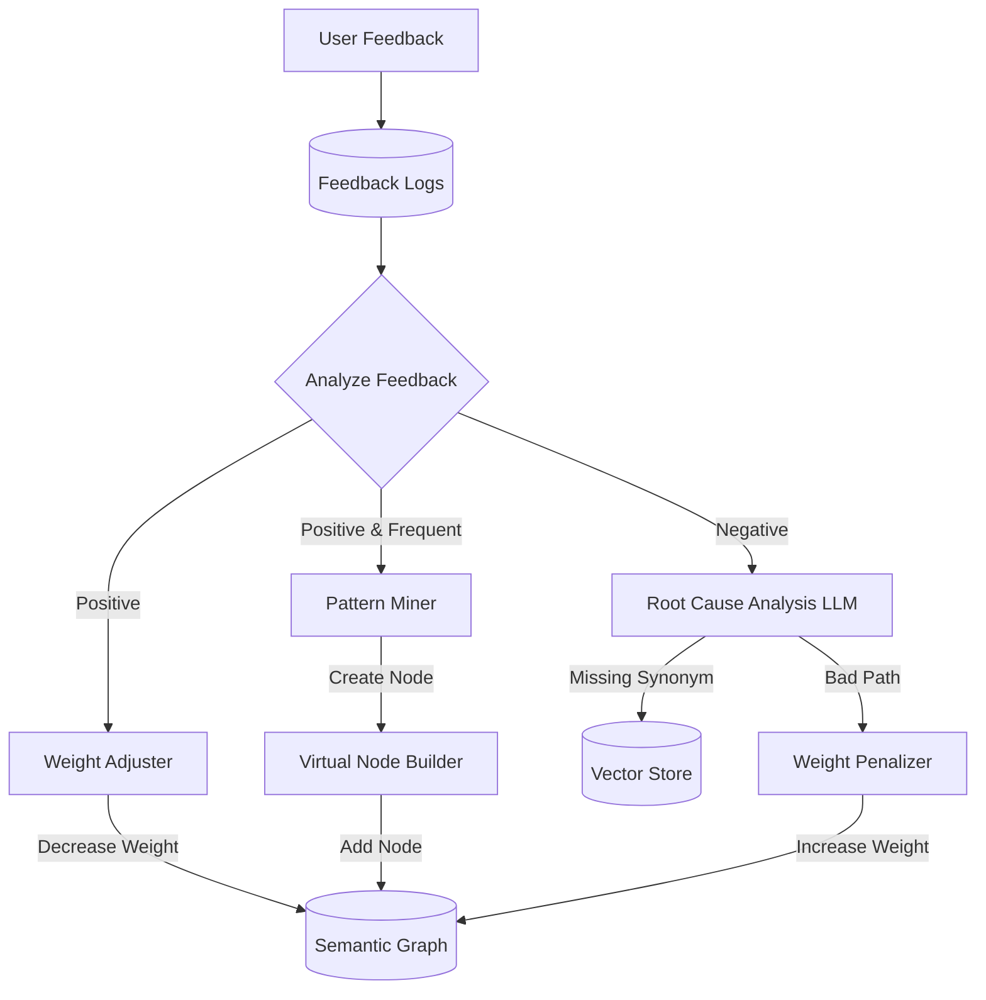

# Data Flow Diagrams (DFD)

## Level 0: Context Diagram

The highest-level view of the system, showing the interaction between the User and the NLQ System.

---

## Level 1: Main Process Flow

Breakdown of the main system processes.

**Processes**:
1.  **Intent Analysis**: Converts NL to structured intent using Vector Store.
2.  **SQL Generation**: Maps intent to Graph Path and generates SQL using LLM.
3.  **Execution & Governance**: Checks for PII, masks data, runs query.
4.  **Evolution Engine**: Updates graph weights based on feedback.

---

## Level 2: Query Processing (Detailed)

Drilling down into the "Query Processing" pipeline.

## Level 2: Evolution Process (Detailed)

Drilling down into the "Evolution Engine".

