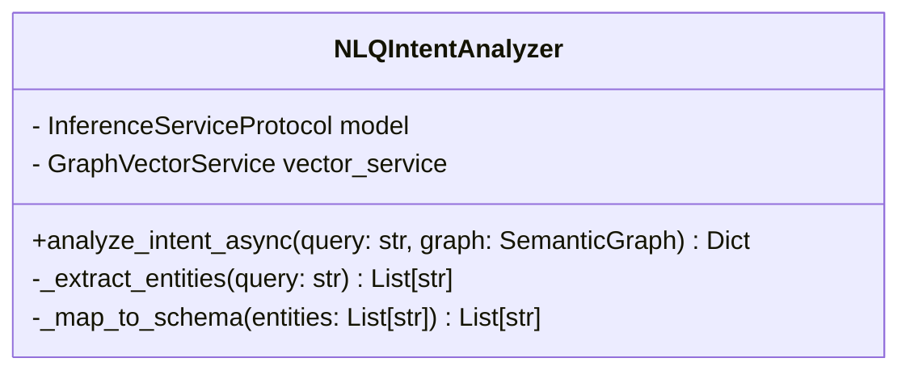
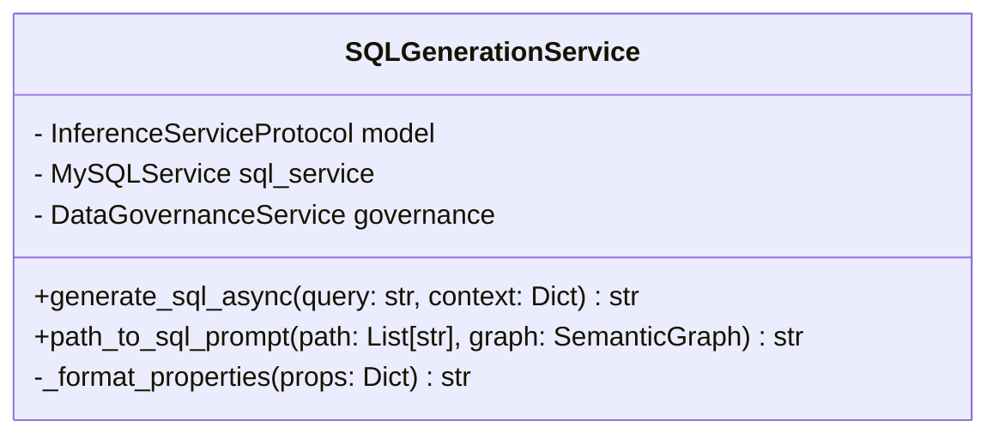
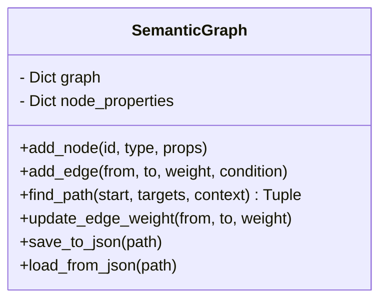
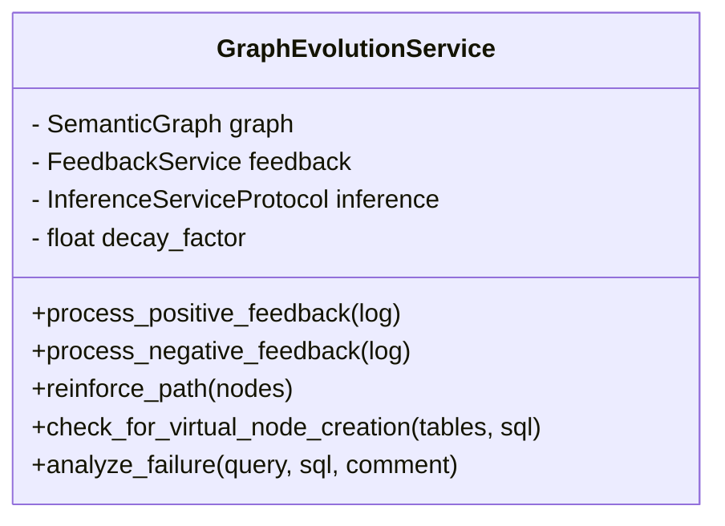
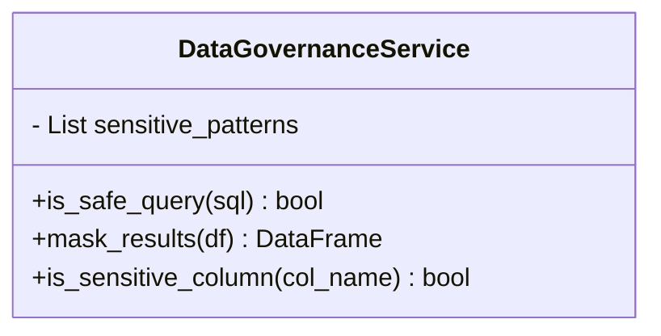

# Low-Level Design (LLD)

This document details the internal design of the core components of the NLQ-to-SQL system.

## 1. NLQ Intent Analyzer (`src/services/nlp.py`)

### Responsibilities
- Analyze user natural language queries.
- Extract intent (e.g., "aggregation", "filtering").
- Identify relevant entities (tables, columns) using Vector Search.

### Class Design

### Key Methods
1.  **`analyze_intent_async`**:
    *   **Input**: `query` (str), `graph` (SemanticGraph)
    *   **Logic**:
        1.  Embed query using `vector_service`.
        2.  Retrieve top-k relevant nodes from ChromaDB.
        3.  Construct prompt with retrieved schema context.
        4.  Call LLM to classify intent and select final tables.
    *   **Output**: Dictionary containing `intent`, `tables`, `filters`.

## 2. SQL Generation Service (`src/services/sql_generation_service.py`)

### Responsibilities
- Construct the prompt for the LLM.
- Generate valid SQL based on the Semantic Graph path.
- Apply Data Governance (masking) *before* execution.

### Class Design

### Key Methods
1.  **`path_to_sql_prompt`**:
    *   **Input**: `path` (List of nodes), `graph`
    *   **Logic**:
        1.  Traverse the path in the Semantic Graph.
        2.  Collect edge conditions (JOIN keys) and node properties (Columns).
        3.  Format into a text block for the LLM System Prompt.
        4.  **Virtual Node Handling**: If a node is `virtual`, inject its `sql_fragment` as a mandatory constraint.

## 3. Semantic Graph (`src/modules/semantic_graph.py`)

### Responsibilities
- Data structure for the schema graph.
- Pathfinding (Dijkstra).
- Managing edge weights and node properties.

### Class Design

## 4. Graph Evolution Service (`src/services/graph_evolution_service.py`)

### Responsibilities
- Process user feedback.
- Adjust edge weights (Reinforcement Learning).
- Create Virtual Nodes for frequent patterns.
- Analyze failures using LLM.

### Class Design

### Key Methods
1.  **`reinforce_path`**:
    *   **Logic**: Iterate through pairs of nodes in the path. Multiply current edge weight by `decay_factor` (0.95). Save graph.
2.  **`check_for_virtual_node_creation`**:
    *   **Logic**: Count occurrences of the table set in positive feedback logs. If count > Threshold, create a new `virtual` node linking these tables.

## 5. Data Governance Service (`src/services/data_governance_service.py`)

### Responsibilities
- Detect sensitive PII in queries and results.
- Mask data.
- Prevent SQL Injection.

### Class Design

