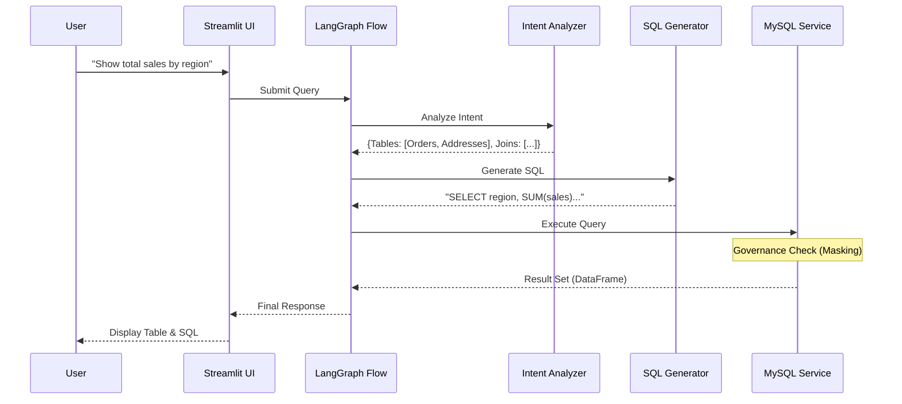

# 3. System Architecture & Design

## 3.1 High-Level Architecture

The system follows a **Modular Monolith** architecture, designed for simplicity, testability, and ease of deployment. It is composed of distinct service layers orchestrated by a central workflow engine.

*   **Architecture Style**: Layered / Service-Based.
*   **Orchestration**: **LangGraph** is used to manage the stateful flow of the query pipeline (Intent -> SQL -> Execution -> Retry).

## 3.2 Tech Stack Rationale

| Component | Technology | Rationale |
| :--- | :--- | :--- |
| **Language** | **Python 3.10+** | The de-facto standard for AI/ML development, offering rich libraries for NLP (LangChain) and data handling (Pandas). |
| **Frontend** | **Streamlit** | Enables rapid development of interactive data applications without needing a separate frontend team. Perfect for data-centric UIs. |
| **Database** | **MySQL** | A widely used, reliable relational database. Chosen to demonstrate enterprise compatibility. |
| **Vector Store** | **ChromaDB** | A lightweight, open-source embedding database that runs locally, reducing infrastructure complexity. |
| **LLM Orchestration** | **LangChain / LangGraph** | Provides robust abstractions for chaining LLM calls, managing memory, and handling state loops (retries). |
| **Validation** | **Pydantic** | Ensures strict data validation and type safety across service boundaries. |

## 3.3 Database Schema (E-Commerce Marketplace)

The system operates on a comprehensive E-Commerce dataset. Key entities include:

*   **Users**: Customer profiles (`user_id`, `email`, `password` [Sensitive]).
*   **Products**: Catalog items (`product_id`, `name`, `price`, `category`).
*   **Orders**: Transaction headers (`order_id`, `user_id`, `total_amount`).
*   **Order_Items**: Line items for each order (`order_item_id`, `product_id`, `quantity`).
*   **Reviews**: User feedback on products.
*   **Sellers**: Vendor information.

*Note: The schema includes Foreign Key constraints to enforce referential integrity, which the Semantic Graph uses to determine join paths.*

## 3.4 Component Diagram

```mermaid
graph TD
    Client[Streamlit UI] --> API[FastAPI / Main Entry]
    
    subgraph "Application Core"
        Orchestrator[LangGraph Orchestrator]
        Intent[NLQ Intent Analyzer]
        SQLGen[SQL Generation Service]
        Gov[Data Governance Service]
        Feedback[Feedback Service]
        Evol[Graph Evolution Service]
    end
    
    subgraph "Infrastructure"
        Vector[ChromaDB Vector Store]
        LLM[LLM Provider (Gemini/OpenAI)]
        DB[(MySQL Database)]
    end
    
    API --> Orchestrator
    Orchestrator --> Intent
    Orchestrator --> SQLGen
    
    Intent --> Vector
    Intent --> LLM
    
    SQLGen --> Gov
    SQLGen --> LLM
    
    Gov --> DB : Validates & Masks

    Client --> Feedback : Submit Rating
    Feedback --> Evol : Trigger Update
    Evol --> Vector : Update Metadata
    Evol --> Intent : Update Graph Weights
```

## 3.5 Sequence Diagram (Query Flow)



## 3.6 Database Agnostic Design (Adapter Pattern)

While the reference implementation uses MySQL, the system is architected to be **database-agnostic**. This is achieved through the **Adapter Pattern** in the `DBService` layer.

*   **Interface**: A common `DBInterface` defines standard methods: `connect()`, `execute_query()`, `get_schema()`, `get_sample_data()`.
*   **Implementations**:
    *   `MySQLService` (Current): Implements the interface for MySQL using `mysql-connector-python`.
    *   `PostgresService` (Future): Can be added by implementing the interface using `psycopg2`.
    *   `OracleService` (Future): Can be added using `cx_Oracle`.
*   **Configuration**: The active adapter is selected at runtime via the `.env` configuration (`DB_TYPE=mysql`), allowing seamless switching without changing the core NLQ logic.

## 3.7 Semantic Graph Initialization (Offline Process)

The system relies on a rich "Semantic Graph" for context. This is not built at query time but pre-computed via an offline initialization process (`init/generate_graph_for_db.py`).

1.  **Schema Extraction**: The `DBSchemaReader` connects to the database and extracts table definitions, columns, and foreign key relationships.
2.  **LLM Profiling**: The `DBProfilingService` samples data from each column (masked for privacy) and sends it to an LLM to generate semantic descriptions (e.g., "This column contains ISO country codes").
3.  **Graph Construction**: A JSON-based graph is built where:
    *   **Nodes** are Tables and Columns.
    *   **Edges** are Foreign Keys and Semantic Relationships (inferred by LLM).
4.  **Vector Indexing**: This graph is embedded into ChromaDB to allow the `Intent Analyzer` to find relevant tables based on meaning, not just keyword matching.

## 3.8 Self-Evolution & Feedback Loop

The system implements a **Reinforcement Learning** loop to improve over time.

1.  **Feedback Collection**: Users rate results (Thumbs Up/Down) via the UI.
2.  **Positive Reinforcement**:
    *   **Edge Weighting**: Successful paths in the graph get their edge weights reduced, making them more likely to be selected by the shortest-path algorithm in future queries.
    *   **Virtual Nodes**: Frequent complex join patterns are solidified into "Virtual Nodes" (e.g., "HighValueCustomers") containing pre-validated SQL fragments.
3.  **Negative Refinement**:
    *   **Failure Analysis**: An LLM analyzes user comments to understand *why* a query failed.
    *   **Metadata Enrichment**: Missing synonyms (e.g., "clients" -> "customers") are added to the Vector Store to fix retrieval gaps.
