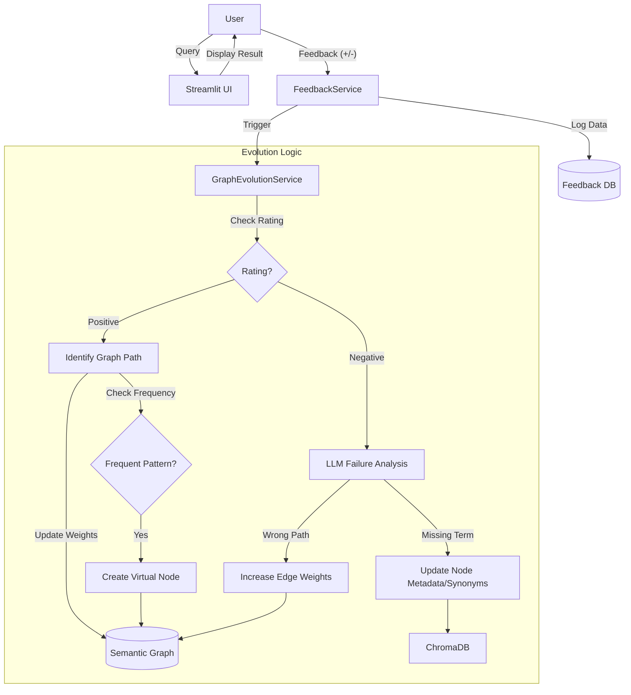

# Self-Evolution & Feedback Loop Design

## 1. Overview
The goal of this module is to enable the Semantic Graph to "learn" from user interactions. By capturing user feedback (Positive/Negative) on generated SQL queries, the system will autonomously evolve its internal knowledge graph to improve future accuracy.

## 2. User Experience (UI)
The Streamlit interface will be updated to include a feedback mechanism immediately after displaying query results.

*   **Components**:
    *   **Rating**: Thumbs Up (✅) / Thumbs Down (❌).
    *   **Feedback Input**: A text area for users to explain *why* the result was correct (optional) or incorrect (required for negative).
    *   **Correction (Advanced)**: Option for power users to provide the *correct* SQL or business logic.

## 3. Architecture Updates

We will introduce two new services:

1.  **FeedbackService**: Responsible for persisting user feedback and the associated query context (User Query, Generated SQL, Graph Path used).
2.  **GraphEvolutionService**: An asynchronous service (or background job) that analyzes feedback to update the Semantic Graph.

### Data Model Changes
*   **`feedback_logs` Table**: Stores the interaction history.
    *   `id`, `user_query`, `generated_sql`, `rating` (1/-1), `user_comment`, `graph_context` (JSON), `timestamp`.
*   **Semantic Graph (JSON)**:
    *   **Edges**: Add `weight` (default 1.0) and `usage_count`.
    *   **Nodes**: Add support for `node_type="virtual"` to represent business concepts (e.g., "Books") that map to SQL fragments.

## 4. Algorithms & Logic

### 4.1 Positive Feedback Handling (Reinforcement)
When a user marks a query as **Correct**:

1.  **Edge Weight Adjustment**:
    *   Identify the path (edges) taken in the Semantic Graph to generate the SQL.
    *   **Action**: Decrease the "cost" (weight) of these edges by a decay factor (e.g., $W_{new} = W_{old} \times 0.95$).
    *   **Effect**: Future pathfinding algorithms (Dijkstra) will prefer these proven connections.

2.  **Virtual Node Creation (Macro Learning)**:
    *   **Trigger**: If a specific complex pattern (e.g., `JOIN products p JOIN category c ON ... WHERE c.name = 'Books'`) receives positive feedback > $N$ times.
    *   **Action**: Create a **Virtual Node** named "Books".
    *   **Edge**: Connect "Books" to "Products" with a special relationship `is_subset_of`.
    *   **Payload**: Store the SQL fragment (`WHERE category.name = 'Books'`) in the node.
    *   **Effect**: Next time a user asks "How many books...", the Intent Analyzer maps directly to the "Books" node, simplifying the graph traversal.

### 4.2 Negative Feedback Handling (Correction)
When a user marks a query as **Incorrect**:

1.  **Failure Analysis (LLM)**:
    *   Feed the User Query, Generated SQL, and User Comment to an LLM.
    *   **Prompt**: "Why did this SQL fail to answer the query? Was it a wrong table, wrong join, or missing filter?"

2.  **Graph Refinement**:
    *   **Missing Metadata**: If the failure was due to unrecognized terminology (e.g., user said "clients" but DB has "customers"), add "clients" to the `synonyms` list of the `customers` node in the Vector Store.
    *   **Bad Path**: Temporarily increase the weight of the edges involved in the bad path (Penalization).

## 5. Process Flowchart

## 6. Implementation Plan

### Phase 1: Feedback Collection (UI & Storage)
1.  Modify `src/ui/app.py` to add feedback buttons.
2.  Create `src/services/feedback_service.py` to save logs to a JSON file or SQLite table.

### Phase 2: Positive Reinforcement (Weights)
1.  Update `SemanticGraph` class to support weighted edges.
2.  Implement `GraphEvolutionService.reinforce_path()` to modify weights based on logs.

### Phase 3: Virtual Nodes (Advanced)
1.  Update Graph Schema to support `virtual` nodes with `sql_fragment` attributes.
2.  Update `SQLGenerationService` to recognize and inject fragments from virtual nodes.
3.  Implement logic to detect frequent patterns and auto-create nodes.

### Phase 4: Negative Refinement (LLM Loop)
1.  Implement `GraphEvolutionService.analyze_failure()` using the LLM.
2.  Implement logic to update ChromaDB metadata dynamically.
