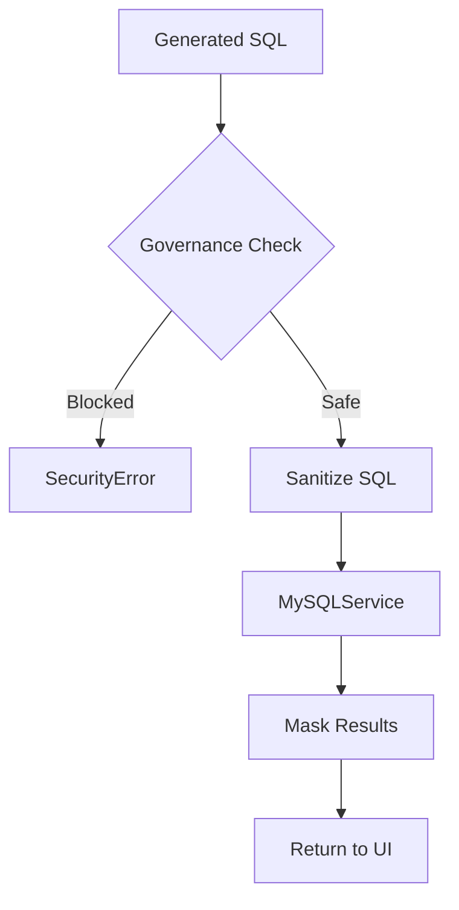
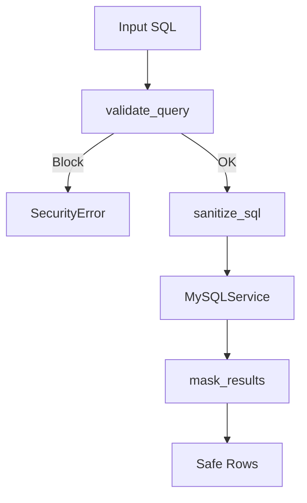

# Data Governance Service

## Overview
`DataGovernanceService` enforces query-time and result-time controls so that no sensitive data leaks through the NLQ-to-SQL pipeline. It blocks adversarial SQL, strips or masks sensitive attributes, and ensures profiling samples are safe.

## Responsibilities
- Validate generated SQL for sensitive access and adversarial patterns.
- Sanitize SQL by masking sensitive columns at query-time.
- Mask result sets and profiling samples at source.
- Provide safe schema context to upstream LLM prompts.

## Dependencies
- `MySQLService` (execution layer) for SQL validation/masking integration.
- `SQLGenerationService` to pre-filter schema context.
- `DBProfilingService` to mask samples at source.
- Config: `DATA_GOVERNANCE_ENABLED`, `DATA_GOVERNANCE_STRICT_MODE`, `SENSITIVE_COLUMNS_CSV`.

## Data Flow (Mermaid)


## Key Algorithms
- **Sensitive Identifier Detection**: Regex-based scanning of identifiers/aliases/subqueries; optional strict `SELECT *` blocking.
- **SQL Sanitization**: Replace sensitive columns with `'***MASKED***'` before execution.
- **Result Masking**: Full/partial masking on returned rows.
- **Schema Filtering for LLM**: Remove sensitive columns from prompt context.

## Key Methods & Complexity
- `is_sensitive_column(name)` — lookup against cached keyword set; $O(1)$ time, $O(K)$ memory for keywords.
- `validate_query(sql, schema_context=None)` — regex scan across tokens; $O(L \times K)$ where $L$ is SQL length and $K$ keyword count.
- `sanitize_sql(sql, mask_value="'***MASKED***'")` — token scan with replacements; $O(L)$.
- `mask_results(rows)` — iterates rows/cols; $O(R \times C)$ where $R$ rows and $C$ masked columns.
- `get_safe_columns(table_columns)` — filters list; $O(C)$.

## Method Flow (Mermaid)


## Constraints & Notes
- Operates in read-only contexts; write queries are blocked upstream.
- Strict mode may reject `SELECT *` on tables containing sensitive columns.
- Masking happens before data leaves the database when possible.

## API Surface
- `is_sensitive_column(name) -> bool`
- `validate_query(sql, schema_context=None) -> (bool, msg)`
- `sanitize_sql(sql, mask_value="'***MASKED***'") -> str`
- `mask_results(rows) -> rows`
- `get_safe_columns(table_columns) -> filtered`

## Usage
```python
gov = DataGovernanceService()
ok, err = gov.validate_query("SELECT email, password FROM users")
if not ok:
    raise SecurityError(err)

safe_sql = gov.sanitize_sql("SELECT email, password FROM users")
```

## Configuration
```bash
DATA_GOVERNANCE_ENABLED=true
DATA_GOVERNANCE_STRICT_MODE=true
SENSITIVE_COLUMNS_CSV=config/sensitive_keywords.csv
```

CSV format:
```csv
keyword,mask_type
password,full
token,full
email,partial
```
# Output: [
#   {"user_id": 1, "email": "user@example.com", "password": "***MASKED***"},
#   {"user_id": 2, "email": "admin@example.com", "password": "***MASKED***"}
# ]
```

## Best Practices

1. **Always integrate at query execution level** - Not just in profiling
2. **Use strict mode in production** - Prevents accidental `SELECT *` exposure
3. **Customize keywords for your domain** - Add industry-specific sensitive terms
4. **Log blocked queries** - Monitor for potential security issues or user education needs
5. **Provide clear error messages** - Help users understand why queries are blocked

## Security Considerations

- **Defense in depth**: Governance is one layer - combine with DB permissions, encryption, audit logs
- **Keyword-based detection**: May not catch all cases (e.g., `user_pwd` vs `user_password`)
- **LLM bypass risk**: Prompt injection could generate non-sensitive-looking SQL that accesses sensitive data indirectly
- **Performance**: Regex matching is fast but scales with number of keywords

## Future Enhancements

- [ ] Column-level access control lists (ACLs)
- [ ] Row-level security policies
- [ ] Partial masking strategies (e.g., show last 4 digits)
- [ ] Audit logging of blocked queries
- [ ] ML-based sensitive data detection
- [ ] Integration with external policy engines (OPA, etc.)
