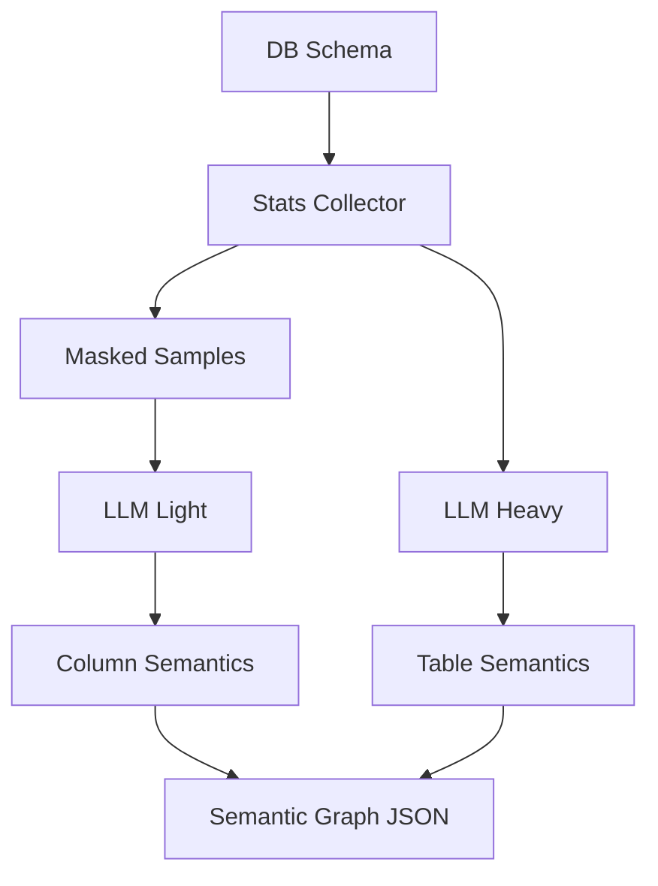

# DB Profiling Service

**File:** `src/services/db_profiling_service.py`

## Overview
Enriches schema metadata with statistics, masked samples, and LLM-generated business semantics. Outputs feed the Semantic Graph, Vector Store, and governance-aware prompts.

## Responsibilities
- Profile tables/columns (row counts, cardinality, null %, value distribution).
- Fetch masked samples (SQL-level masking) to keep PII in-database.
- Generate business context via LLM (purpose, domain, impact, typical queries).
- Suggest virtual tables/views based on patterns.

## Dependencies
- `DBReaderProtocol` (metadata access).
- `InferenceServiceProtocol` (light + heavy LLMs).
- `MySQLService` for sample queries.
- `DataGovernanceService` for masking rules.

## Data Flow (Mermaid)


## Key Algorithms
- **SQL-Level Masking**: Generates `SELECT col, '***MASKED***' AS sensitive FROM table LIMIT N` to avoid exporting PII.
- **Categorical Detection**: `is_categorical = distinct_count / row_count < threshold`.
- **Virtual Table Heuristics**: Detects common filter combinations (e.g., category='Books') and proposes view definitions.
- **Dual-LLM Strategy**: Light model for per-column descriptions; heavy model for table/business context.

## Constraints
- Read-only access; profiling queries must not mutate data.
- Masking is mandatory when sensitive columns are present.
- Sampling limits (e.g., 5-10 rows) to control cost and latency.

## Key Methods
- `profile_database(dbname) -> dict` — loops tables; $O(T \times (C + S))$ where $T$ tables, $C$ avg columns/table, $S$ sampled rows.
- `profile_table(dbname, table) -> dict` — stats + LLM calls; $O(C + S)$ plus LLM latency $O(LLM)$.
- `_get_sample_rows(...)` — runs limited select; $O(S)$ over returned rows.

## Method Flow (Mermaid)
```mermaid
flowchart TD
    Start[profile_database] --> Tables[list tables]
    Tables --> Loop[for each table]
    Loop --> Stats[profile_table]
    Stats --> Sample[_get_sample_rows (masked)]
    Sample --> LLM1[light_llm column semantics]
    Stats --> LLM2[heavy_llm table semantics]
    LLM1 --> Merge[merge results]
    LLM2 --> Merge
    Merge --> Out[profiling JSON]
```

## Sample Output (Table)
```json
{
  "row_count": 1500,
  "business_purpose": "Product catalog",
  "data_domain": "Inventory & Sales",
  "business_impact": "HIGH",
  "typical_queries": ["Show all books", "Products low on stock"],
  "column_statistics": {"category": {"distinct_count": 12, "is_categorical": true}},
  "column_descriptions": {"category": {"description": "Product category"}}
}
```
```

### Virtual Tables
```python
{
    "customer_order_summary": {
        "type": "virtual_table",
        "description": "Aggregated customer order statistics",
        "suggested_sql": "CREATE VIEW customer_order_summary AS SELECT ...",
        "use_case": "Answers queries like 'show customer purchase history'"
    }
}
```

## Integration with Semantic Graph

The profiling service integrates seamlessly with `SchemaGraphService`:

```python
from src.services.db_profiling_service import DBProfilingService
from src.services.schema_graph_service import SchemaGraphService

# Setup profiling
profiling_service = DBProfilingService(
    db_reader=db_reader,
    light_llm=light_llm,
    heavy_llm=heavy_llm,
    governance_config=governance
)

# Build enriched graph
graph_service = SchemaGraphService(
    db_reader=db_reader,
    dbname="ecommerce_marketplace",
    profiling_service=profiling_service
)

# Graph nodes now contain rich metadata
graph_service.build_and_save(enable_profiling=True)
```

## Configuration

### Environment Variables
```bash
# Profiling Control
ENABLE_DB_PROFILING=true
CATEGORICAL_THRESHOLD=0.1
PROFILING_SAMPLE_SIZE=10000

# Data Governance
DATA_MASKING_ENABLED=true
SENSITIVE_COLUMNS_CSV=config/sensitive_keywords.csv

# LLM Selection
LIGHT_LLM_PROVIDER=openai
LIGHT_LLM_MODEL=gpt-4o-mini
HEAVY_LLM_PROVIDER=gemini
HEAVY_LLM_MODEL=gemini-2.5-flash
```

## Benefits

### 1. Semantic Understanding
System now knows that "books" is a value in `products.category`, not a separate table.

**Before:** Query "show books" → Search for "books" table → Fail
**After:** Query "show books" → Vector search finds "books" in products.category → Success

### 2. Business Context
Tables have purpose, domain, and typical queries that help with intent extraction.

### 3. Cost Optimization
Light LLM for descriptions, Heavy LLM for complex analysis minimizes API costs.

### 4. Data Security
Sensitive columns automatically masked before LLM processing.

### 5. Virtual Tables
LLM suggests useful aggregate views that simplify complex queries.

## Usage Example

```python
# Initialize services
mysql_service = MySQLService()
db_reader = DBSchemaReaderService(mysql_service)

light_llm = OpenAIService(model="gpt-4o-mini")
heavy_llm = GeminiService()

governance = DataGovernanceConfig(
    sensitive_keywords_csv="config/sensitive_keywords.csv"
)

profiling_service = DBProfilingService(
    db_reader=db_reader,
    light_llm=light_llm,
    heavy_llm=heavy_llm,
    governance_config=governance
)

# Profile database
profile_data = profiling_service.profile_database("ecommerce_marketplace")

# Access results
products_profile = profile_data["tables"]["products"]
print(products_profile["business_purpose"])
print(products_profile["typical_queries"])
```

## Performance Considerations

- **Sampling**: For large tables (>1M rows), consider adding sampling logic
- **Caching**: Profile results can be cached and regenerated periodically
- **Batch Processing**: Column descriptions processed in batches to minimize LLM calls
- **Parallel Execution**: Future enhancement to profile multiple tables in parallel
