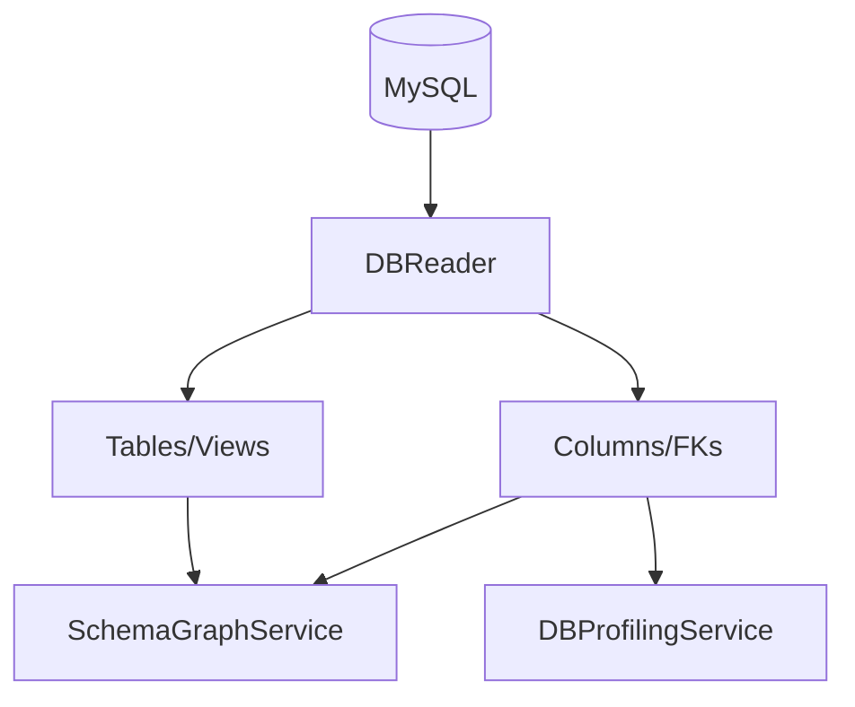
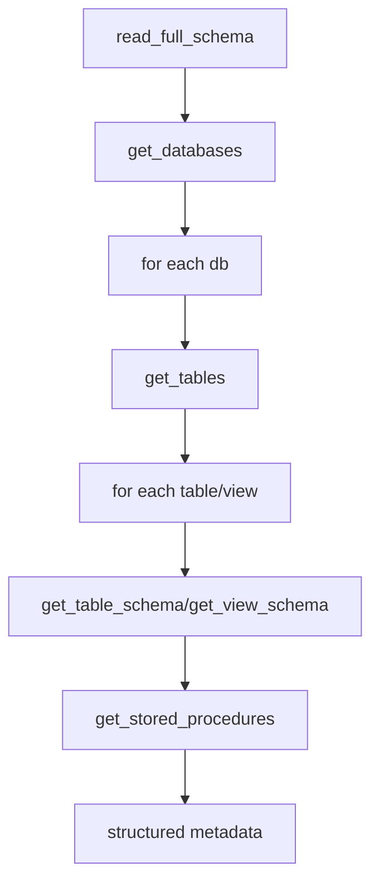

# DB Reader Service

**File:** `src/services/db_reader.py`

## Overview
Reads database metadata from `information_schema` to bootstrap graph construction and profiling.

## Responsibilities
- List databases (excluding system DBs).
- Enumerate tables/views, columns, indexes, FKs.
- Retrieve view definitions and stored procedures.
- Provide structured metadata to SchemaGraphService/DBProfilingService.

## Dependencies
- `MySQLService` for executing metadata SQL.

## Data Flow (Mermaid)

## Key Methods
- `get_databases()` — list non-system schemas; $O(D)$ where $D$ schemas.
- `get_tables(database)` — fetch table/view names; $O(T)$.
- `get_table_schema(database, table)` — columns + FKs; $O(C + F)$.
- `get_view_schema(database, view)` — parse definition; $O(|V|)$ by definition length.
- `get_stored_procedures(database)` — $O(P)$ procedures.
- `read_full_schema()` — orchestrates above; $O(D + \sum T + \sum(C+F))$.

## Method Flow (Mermaid)

## Constraints
- Read-only connection; no DDL/DML.
- Must filter out system schemas (`information_schema`, `mysql`, etc.).
