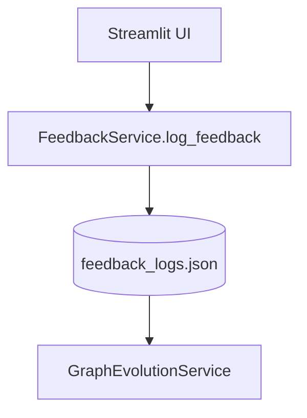
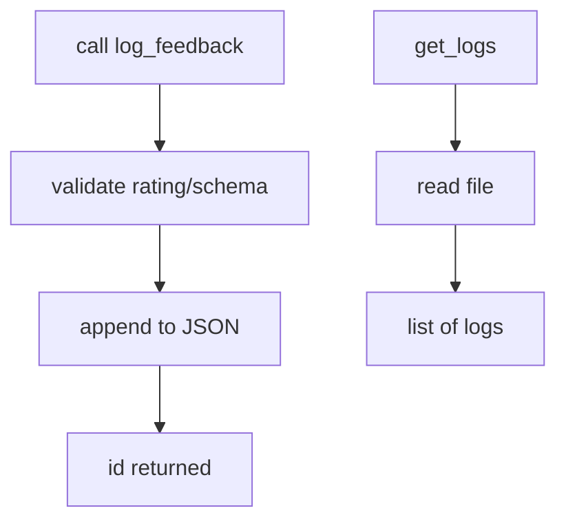

# Feedback Service

**File:** `src/services/feedback_service.py`

## Overview
Captures user feedback (thumbs up/down, optional comments, graph context) after query execution to drive self-evolution of the semantic graph.

## Responsibilities
- Persist feedback logs (query, generated SQL, rating, comments, graph context).
- Provide retrieval API for evolution processing.

## Dependencies
- Storage: JSON file (`feedback_logs.json` by default) or replaceable backend.
- Consumers: `GraphEvolutionService`, UI (Streamlit).

## Data Flow (Mermaid)


## Key Methods
- `log_feedback(user_query, generated_sql, rating, user_comment=None, graph_context=None) -> id` — append JSON entry; $O(1)$ amortized for file append.
- `get_logs() -> List[Dict]` — load full log file; $O(F)$ where $F$ is number of feedback entries.

## Method Flow (Mermaid)


## Constraints
- Currently appends to a JSON file; concurrency-safe storage (DB/queue) can replace it in production.
- Ratings: `1` (positive), `-1` (negative).

## Data Model
```json
{
  "id": "20251222093000123456",
  "timestamp": "2025-12-22T09:30:00Z",
  "user_query": "Show total sales",
  "generated_sql": "SELECT SUM(total) FROM orders",
  "rating": 1,
  "user_comment": "Works",
  "graph_context": {"tables": ["orders"], "joins": []}
}
```
