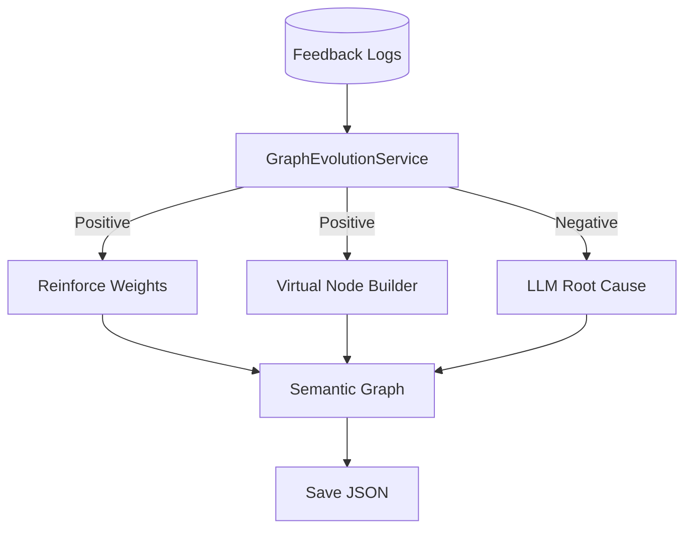
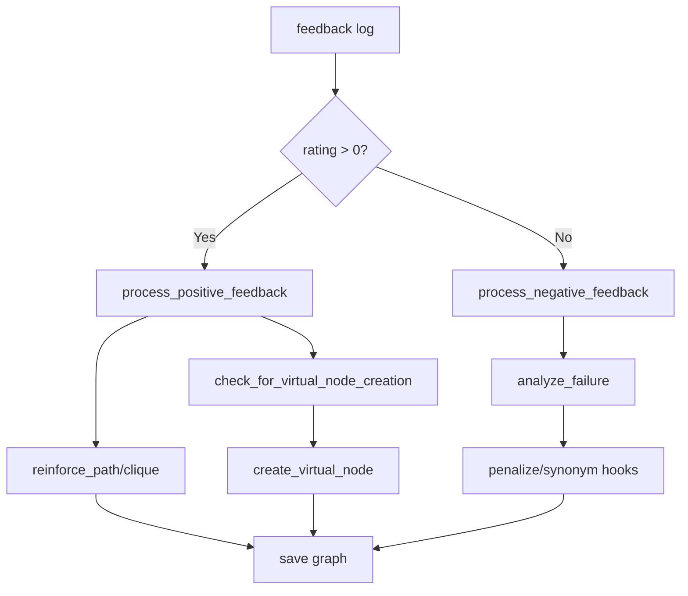

# Graph Evolution Service

**File:** `src/services/graph_evolution_service.py`

## Overview
Learns from user feedback to reinforce successful graph paths, create virtual nodes for frequent patterns, and analyze failures with LLMs.

## Responsibilities
- Process positive feedback: lower edge weights on successful paths; consider virtual node creation.
- Process negative feedback: call LLM to diagnose root cause; suggest synonyms or penalize bad paths.
- Persist graph updates back to JSON.

## Dependencies
- `SemanticGraph` (mutable in-memory graph).
- `FeedbackService` (feedback logs).
- `InferenceServiceProtocol` (LLM for failure analysis).
- `graph_path` for saving updated graph JSON.

## Data Flow (Mermaid)

## Key Algorithms
- **Weight Decay (Positive)**: `new_weight = old_weight * 0.95` along path/clique of tables.
- **Pattern Mining (Virtual Nodes)**: Count positive feedback occurrences per table-set; if frequency >= threshold, create a `virtual` node with `sql_fragment` and low-weight links.
- **Failure Analysis (Negative)**: LLM-structured output to decide actions:
  - `add_synonym`: update vector metadata (future hook).
  - `penalize_path`: increase weights on bad edges (planned extension).

## Key Methods
- `process_positive_feedback(log_entry)`
- `process_negative_feedback(log_entry)`
- `reinforce_path(nodes)` / `reinforce_clique(nodes)`
- `check_for_virtual_node_creation(tables, generated_sql)`
- `create_virtual_node(tables, sql_fragment)`
- `analyze_failure(query, sql, comment)`

## Key Methods & Complexity
- `process_positive_feedback` — walk path/clique; $O(P)$ edges, plus virtual-node check $O(V)$ candidate set.
- `reinforce_path` / `reinforce_clique` — weight update along path/clique; $O(P)$.
- `check_for_virtual_node_creation` — count occurrences; $O(V)$ where $V$ is tracked pattern count.
- `create_virtual_node` — add node + edges; $O(1)$ per edge addition.
- `process_negative_feedback` — LLM RCA $O(LLM)$ plus optional weight adjustments $O(P)$.
- `analyze_failure` — LLM call; cost bound by provider latency.

## Method Flow (Mermaid)

## Constraints
- Requires feedback `graph_context` to include tables used.
- Virtual node fragment currently stores full SQL fragment; extraction of join/filter clauses can be refined.
- Persistence writes the graph JSON; callers should reload embeddings after graph changes.
