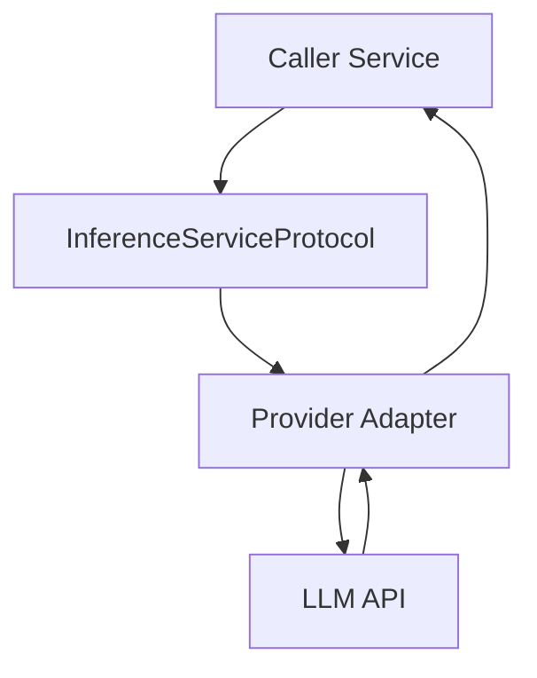
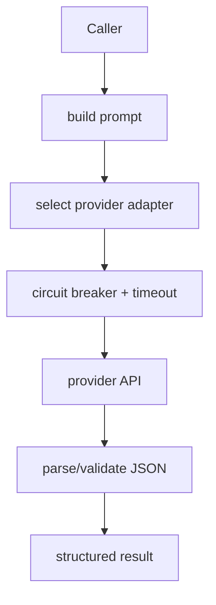

# Inference Service

**File:** `src/services/inference.py`

## Overview
Provides a unified interface to multiple LLM providers (Gemini, OpenAI, Ollama) with resiliency (circuit breakers, retries) and structured outputs used across intent analysis, SQL generation, and failure analysis.

## Responsibilities
- Normalize LLM calls behind `InferenceServiceProtocol`.
- Provide sync/async chat, summaries, and structured JSON outputs.
- Apply circuit breakers and timeouts per provider.

## Dependencies
- Environment keys: `OPENAI_API_KEY`, `GEMINI_API_KEY`.
- `httpx` / provider SDKs for transport.
- Circuit breaker utilities in `src/utils/circuit_breaker.py`.

## Data Flow (Mermaid)

## Key Algorithms / Patterns
- **Circuit Breaker** per provider to avoid cascading failures.
- **Structured Output Parsing**: LLM prompt templates that force JSON; fallback to regex cleanup on malformed JSON.
- **Provider Fallbacks**: Container can switch providers via config; adapters share the same protocol.

## API Surface (Protocol)
- `get_summary(content, max_words=100)` / `get_summary_async`
- `get_structured_output(content, json_schema)` / async variant
- `analyze_intent(...)` (provider-specific helpers)
- `chat_completion(message, context=None)` / async variant

## Key Methods & Complexity
- `get_summary` — prompt + provider call; time dominated by LLM latency $O(LLM)$, negligible local $O(|content|)$.
- `get_structured_output` — same as above; includes JSON parse $O(|response|)$.
- `chat_completion` — LLM latency bound; streaming variants $O(|tokens|)$ to consume.
- `analyze_intent` — lightweight prompt assembly $O(|context|)$ plus LLM $O(LLM)$.

## Method Flow (Mermaid)

## Implementations
- `GeminiService` (requires `GEMINI_API_KEY`, model `gemini-2.5-flash`).
- `OpenAIService` (requires `OPENAI_API_KEY`, model configurable).
- `OllamaService` (local model name via `LLM_MODEL`).
- `ModelInferenceService` (wrapper/facade for routing).

## Constraints
- Requests must respect provider rate limits; circuit breaker opens on repeated failures.
- JSON coercion may require defensive parsing when LLM output is malformed.
