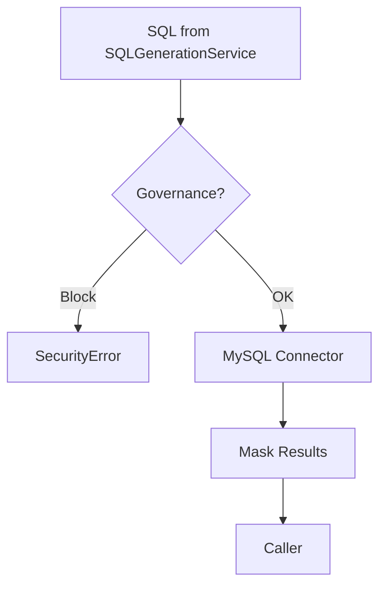
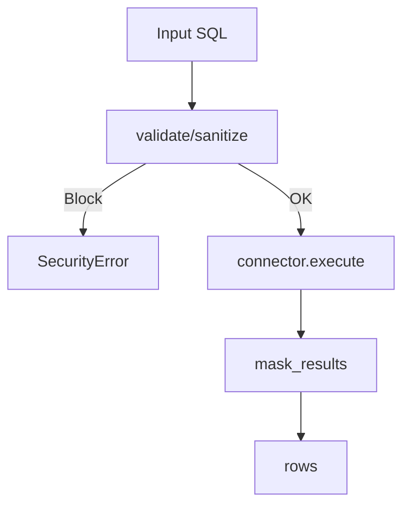

# MySQL Service

**File:** `src/services/mysql_service.py`

## Overview
Thin wrapper over MySQL connector with governance hooks. Executes SQL generated by the pipeline, masks sensitive results, and provides metadata for profiling.

## Responsibilities
- Manage DB connections from environment configuration.
- Execute read-only SQL with optional dict output.
- Integrate DataGovernanceService for validation/masking.
- Provide low-level access for profiling/metadata queries.

## Dependencies
- Env vars: `MYSQL_HOST`, `MYSQL_USER`, `MYSQL_PASSWORD`, `MYSQL_DATABASE`.
- `DataGovernanceService` (optional) to block/clean SQL and mask results.

## Data Flow (Mermaid)

## Key Methods
- `execute_query(sql, asDict=True)` — governance scan $O(L \times K)$ then DB execution; result masking $O(R \times C)$.
- `run_sql(sql)` — thin wrapper around `execute_query`; same complexity.
- `shutdown()` — closes open connection; $O(1)$.

## Method Flow (Mermaid)

## Constraints
- Read-only usage in this project; writes are disallowed upstream.
- Connection pooling not implemented; current scope is single-tenant.
