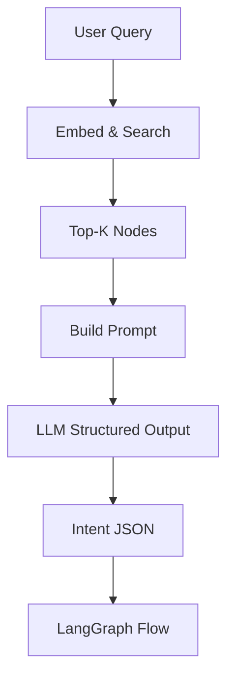
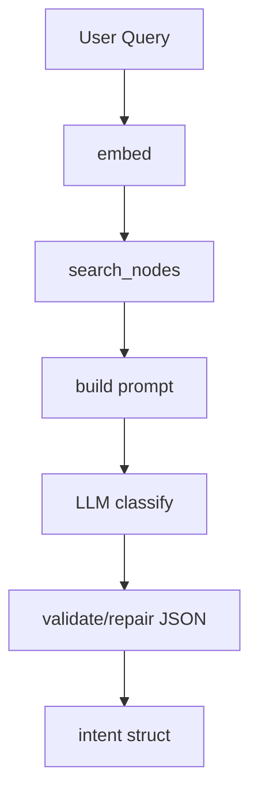

# NLP Service

**File:** `src/services/nlp.py`

## Overview
`NLQIntentAnalyzer` transforms a natural language query into graph traversal hints (tables, joins, conditions) using retrieval + LLM classification.

## Responsibilities
- Retrieve relevant schema nodes via semantic search.
- Prompt the LLM to emit intent, tables, joins, and filters.
- Validate and normalize structured intent.

## Dependencies
- `InferenceServiceProtocol` (LLM).
- `GraphVectorService` (semantic search over graph nodes).
- `SemanticGraph` (schema graph).

## Data Flow (Mermaid)

## Algorithm
1. Embed query with vector service; fetch top-k nodes.
2. Build prompt listing candidate tables/columns + user query.
3. Ask LLM for JSON: `{tables, joins, filters, intent}`.
4. Validate keys; default to safe fallbacks if missing.

## Constraints
- Relies on vector store freshness; regenerate embeddings after schema changes.
- LLM output may be malformed; must validate/repair JSON.

## Key Methods
- `analyze_intent(user_query, graph) -> dict` — embed + search $O(E + N)$ where $E$ embed cost, $N$ nodes scanned by vector search (sublinear with index); prompt + LLM $O(LLM)$; JSON validation $O(|response|)$.

## Method Flow (Mermaid)

