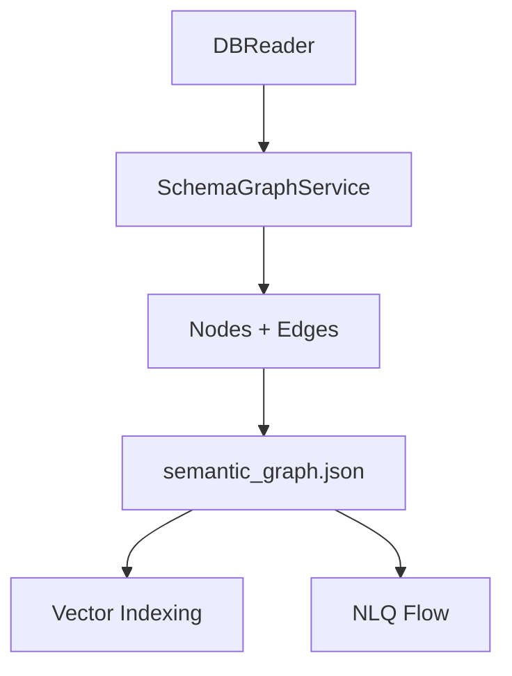
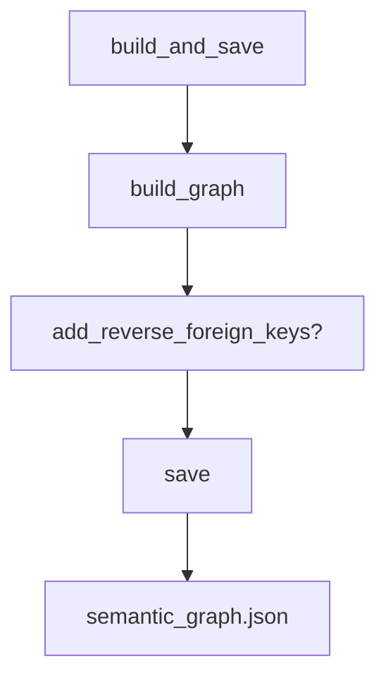

# Schema Graph Service

**File:** `src/services/schema_graph_service.py`

## Overview
Builds the `SemanticGraph` from database metadata (tables, columns, FKs) and exports JSON consumed by vector indexing and LangGraph.

## Responsibilities
- Extract tables/columns/FKs from DBReader.
- Create table nodes, column nodes, association edges, and FK edges.
- Optionally add reverse edges for bidirectional traversal.
- Persist graph JSON to `schemas/`.

## Dependencies
- `DBReaderProtocol` for metadata.
- `SemanticGraph` for graph construction.

## Data Flow (Mermaid)

## Key Methods
- `build_graph()` — iterate metadata; $O(T + C + F)$ for tables, columns, FKs.
- `add_reverse_foreign_keys()` — duplicates FK edges; $O(F)$.
- `save()` — serialize graph; $O(V + E)$.
- `build_and_save(add_reverse_fks=True)` — orchestration; $O(T + C + F)$ overall.

## Method Flow (Mermaid)

## Constraints
- Assumes complete FK metadata in `information_schema`.
- Graph size grows with schema; consider pruning unused schemas.
