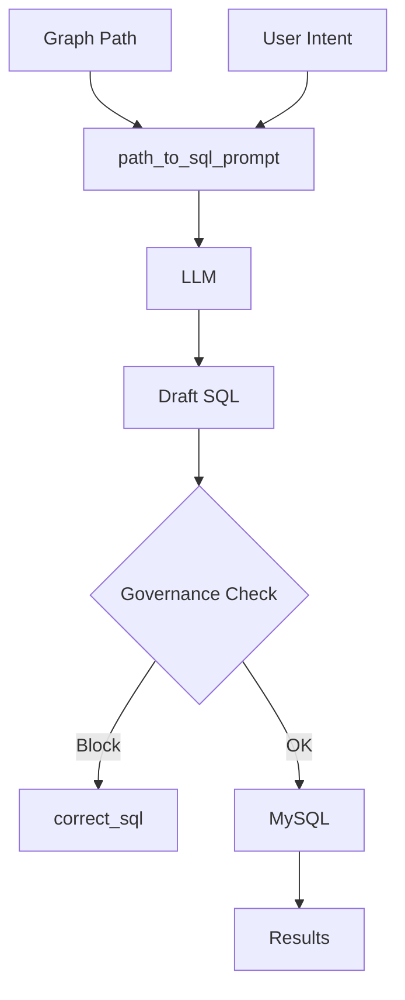
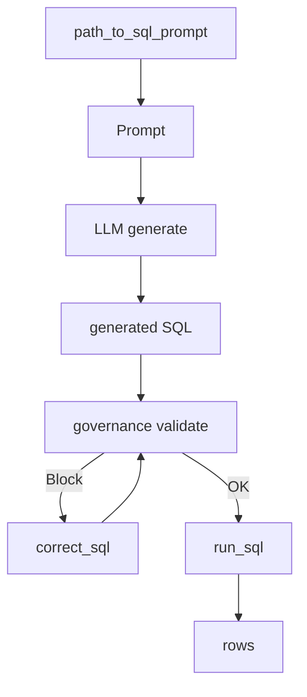

# SQL Generation Service

**File:** `src/services/sql_generation_service.py`

## Overview
Transforms graph paths and user intent into governed SQL using LLM prompting. Enforces governance, injects virtual node fragments, and calls MySQL for execution.

## Responsibilities
- Convert `SemanticGraph` path + intent into LLM prompt.
- Incorporate governance filters (remove sensitive columns) before prompt.
- Handle virtual nodes (mandatory SQL fragments).
- Execute SQL via MySQLService; retry/correct on errors.

## Dependencies
- `InferenceServiceProtocol` (LLM).
- `MySQLService` (execution).
- `DataGovernanceService` (filter/mask).
- `SemanticGraph` (edges, node metadata).

## Data Flow (Mermaid)

## Key Algorithms
- **Prompt Construction**: Enumerate nodes/edges; for `virtual` nodes inject `sql_fragment` as mandatory clause.
- **Governance Filtering**: Remove sensitive columns from prompt context; sanitize SQL before execution.
- **Correction Loop**: On DB error, re-prompt LLM with error details up to retry limit.

## Key Methods
- `path_to_sql_prompt(path, graph) -> str` — walks nodes/edges; $O(|path|)$.
- `generate_sql(path, graph, user_query="") -> str` — prompt build $O(|path|)$, LLM $O(LLM)$, governance filter $O(L \times K)$.
- `correct_sql(invalid_sql, error_message, user_query) -> str` — retry loop up to $R$; cost $R \times O(LLM)$.
- `run_sql(sql) -> List` — MySQL execution; row scan $O(R \times C)$ plus governance masking.

## Method Flow (Mermaid)

## Constraints
- Assumes read-only queries; DML/DDL blocked upstream.
- Virtual nodes carry fragments that must be honored to keep intent fidelity.
