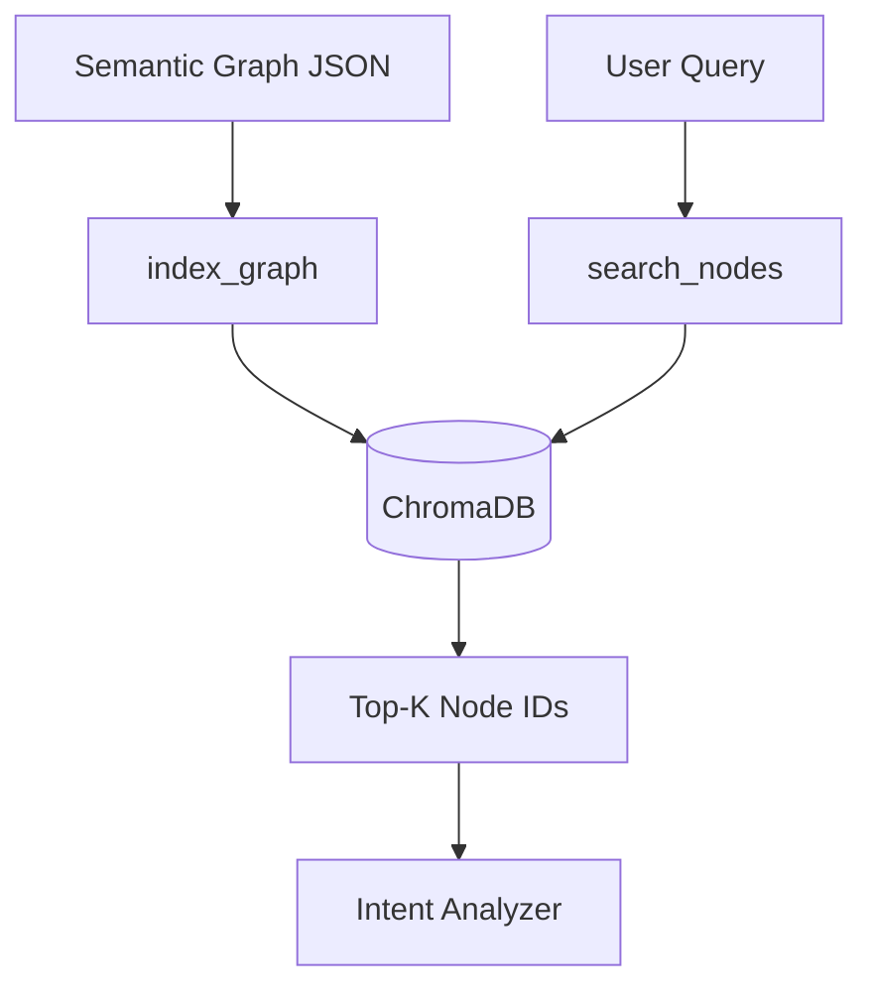
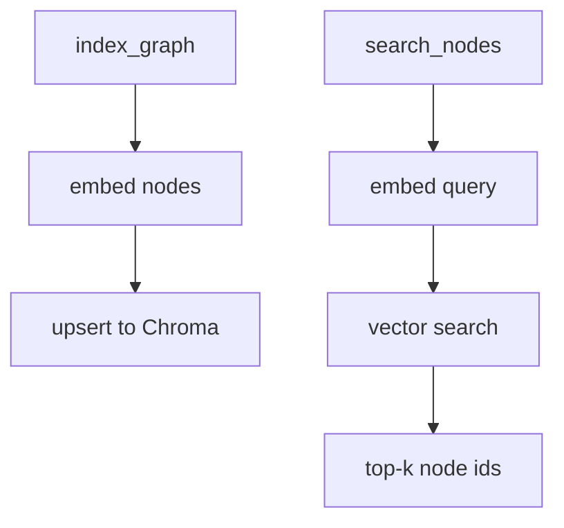

# Vector Service

**File:** `src/services/vector_service.py`

## Overview
Indexes semantic graph nodes into ChromaDB using Ollama embeddings for fast semantic retrieval of tables/columns relevant to a user query.

## Responsibilities
- Generate embeddings for nodes (type, id, properties).
- Upsert into ChromaDB collection.
- Retrieve top-k nodes for query text; feed Intent Analyzer.

## Dependencies
- `chromadb` client.
- `OllamaEmbeddingFunction` (e.g., `nomic-embed-text`).
- `SemanticGraph` as source of nodes.

## Data Flow (Mermaid)

## Key Methods
- `index_graph(graph)` — embeds $N$ nodes; cost $O(N \times E)$ for embedding plus upsert.
- `search_nodes(query, k=50)` — embed query $O(E)$; vector search sublinear $O(\log N)$ (index-dependent) returning top-$k$.

## Method Flow (Mermaid)

## Constraints
- Embeddings must be refreshed after graph changes (schema updates, virtual nodes).
- Collection name default: `schema_nodes`; configurable in ctor.
